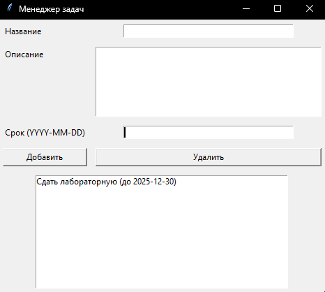
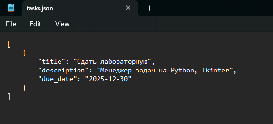

# Task Manager

Простое desktop-приложение для управления задачами (Python + Tkinter).

## Запуск
```bash
python gui.py
```

## Возможности
- Добавление задач
- Удаление задач
- Автосохранение в JSON

## Скриншоты

### Главное окно приложения


### Сохранение задач в файл


